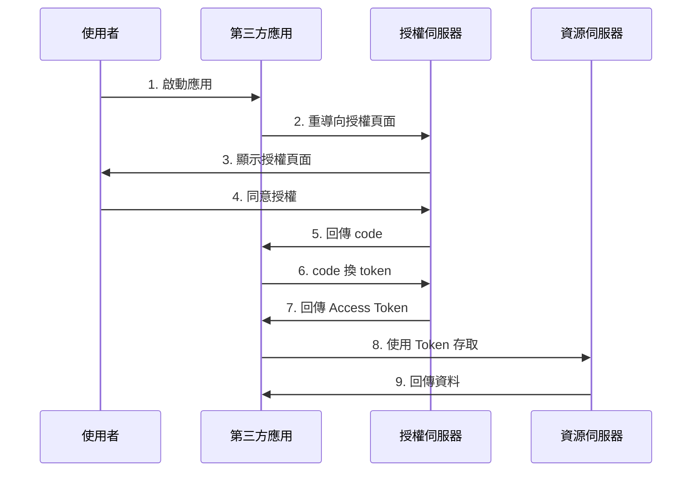
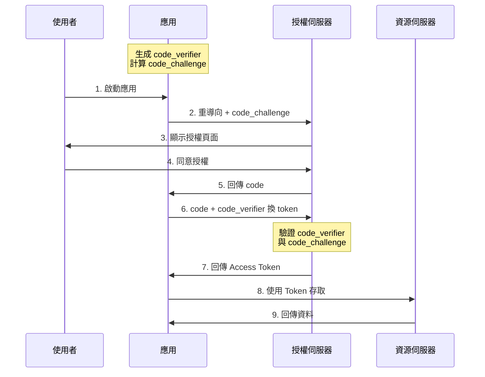
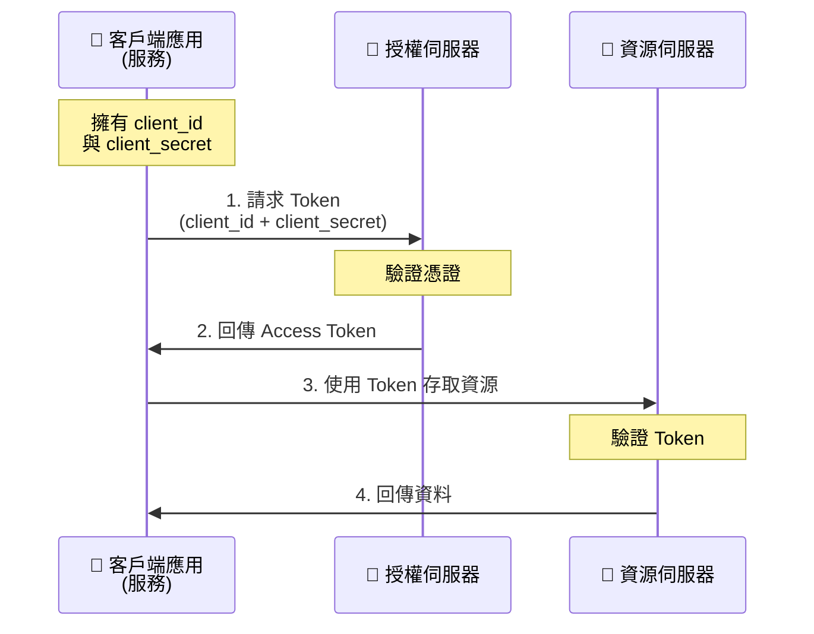

# OAuth 2.0

現代應用程式的認證與授權

---
layout: two-cols
layoutClass: gap-16
---

# 什麼是 OAuth 2.0？

OAuth 2.0 是一個**授權框架**，讓第三方應用程式能夠取得有限的使用者資源存取權限。

<v-clicks>

-  **授權標準** - 不是認證標準
-  **委託授權** - 使用者授權而非共享密碼
-  **廣泛應用** - Google, Facebook, GitHub 等

</v-clicks>

使用者無需將密碼交給第三方，而是透過 Token 來存取資源

---

# 為什麼需要 OAuth 2.0？

###  傳統方式的問題

<v-clicks>

- 第三方應用儲存使用者密碼
- 無法撤銷特定應用權限
- 第三方獲得完整權限
- 安全風險高

</v-clicks>

###  OAuth 2.0 的優勢

<v-clicks>

- 不需共享密碼
- 權限控制 (Scope)
- 可隨時撤銷授權
- Token 有時效性

</v-clicks>

---

# OAuth 2.0 的四個角色

### 🧑 Resource Owner
**資源擁有者** - 通常是終端使用者

### 📱 Client
**客戶端** - 第三方應用程式

### 🔐 Authorization Server
**授權伺服器** - 核發 Access Token

### 💾 Resource Server
**資源伺服器** - 託管受保護資源

---

# 主要授權類型 (Grant Types)

| 授權類型 | 使用場景 | 推薦度 |
|---------|---------|--------|
| **Authorization Code** | 後端應用 | ⭐⭐⭐⭐⭐ |
| **Authorization Code + PKCE** | SPA / 行動 App | ⭐⭐⭐⭐⭐ |
| **Client Credentials** | 服務對服務  | ⭐⭐⭐⭐ |
| **Password** ⚠️ | ~~已不推薦~~ | ❌ |

---

# Authorization Code Flow

常用授權流程

---

# Authorization Code Flow with PKCE

適用於 SPA 和行動應用的安全增強流程

---

# Client Credentials Flow

適用於服務對服務 (Machine-to-Machine) 的授權流程

---
layout: center
class: text-center
---

# Thanks

📚 [RFC 6749](https://tools.ietf.org/html/rfc6749) · [OAuth.net](https://oauth.net/2/)

