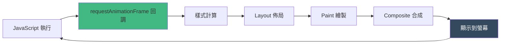

# requestAnimationFrame

---
layout: two-cols
---

# 什麼是 requestAnimationFrame？

`requestAnimationFrame`（簡稱 rAF）是瀏覽器提供的 API，用於優化動畫與視覺更新。

## 核心特點

- **與瀏覽器重繪同步**：在下一次重繪前執行
- **自動優化**：背景分頁會暫停，節省資源
- **流暢體驗**：通常 60fps（約每 16.67ms 一次）
- **遞迴呼叫**：需要手動在回調中再次呼叫

::right::

## 基本語法

```js
function animate() {
  // 更新動畫狀態

  // 遞迴呼叫
  requestAnimationFrame(animate);
}

// 啟動動畫
requestAnimationFrame(animate);
```

```js
// 取消動畫
const id = requestAnimationFrame(animate);
cancelAnimationFrame(id);
```

---
layout: default
---

# 為什麼需要 requestAnimationFrame？

<div class="grid grid-cols-2 gap-8">

<div>

## 傳統方法：setTimeout / setInterval

```js
// 嘗試 60fps = 16.67ms
setInterval(() => {
  updateAnimation();
}, 16.67);
```

### 問題：
- 不與瀏覽器重繪週期同步
- 可能造成掉幀或重複渲染
- 背景分頁仍持續執行，浪費資源
- 執行時間不精確

</div>

<div>

## rAF 的優勢

```js
function animate(timestamp) {
  updateAnimation();
  requestAnimationFrame(animate);
}
requestAnimationFrame(animate);
```

### 優點：
- 與瀏覽器渲染同步
- 背景分頁自動暫停
- 提供高精度時間戳
- 更好的性能與流暢度

</div>

</div>

---
layout: default
---

# 瀏覽器渲染週期與 rAF





**關鍵時機：** rAF 在重繪之前執行，確保所有 DOM 修改都在同一幀內完成

---
layout: default
---

# 基本用法範例

<div class="grid grid-cols-2 gap-4">

<div>

## 簡單移動動畫

```js
let position = 0;

function moveBox() {
  position += 2;

  const box = document.getElementById('box');
  box.style.transform =
    `translateX(${position}px)`;

  if (position < 500) {
    requestAnimationFrame(moveBox);
  }
}

requestAnimationFrame(moveBox);
```

</div>

<div>

## 使用時間戳控制速度

```js
let startTime = null;

function animate(timestamp) {
  if (!startTime) startTime = timestamp;
  const elapsed = timestamp - startTime;

  // 每秒移動 100px
  const position = (elapsed / 1000) * 100;

  const box = document.getElementById('box');
  box.style.transform =
    `translateX(${position}px)`;

  if (position < 500) {
    requestAnimationFrame(animate);
  }
}

requestAnimationFrame(animate);
```

</div>

</div>

---
layout: default
---

<div class="flex justify-center items-center">
  <AnimationDemo />
</div>

---
layout: default
---

# 最佳實踐


## 1. 使用 transform 和 opacity（只觸發 Composite）

```js
// 不好：觸發 Layout 和 Paint - 慢
element.style.left = x + 'px';
element.style.top = y + 'px';

// 好：只觸發 Composite - 快
element.style.transform = `translate(${x}px, ${y}px)`;
```

## 2. 避免在回調中進行大量計算

```js
// 不好：計算可能超過 16ms，造成掉幀
function animate() {
  heavyComputation();
  updateDOM();
  requestAnimationFrame(animate);
}

// 好：只做必要的 DOM 更新
function animate() {
  updateDOM(); // 計算移到 Web Worker 或非同步處理
  requestAnimationFrame(animate);
}
```

---
layout: default
---

# 最佳實踐（續）


## 3. 批量讀取與寫入 DOM（避免 Layout Thrashing）

```js
// 不好：造成多次 reflow
elements.forEach(el => {
  const height = el.offsetHeight; // 讀取
  el.style.height = height + 10 + 'px'; // 寫入，觸發 reflow
});

// 好：分離讀取與寫入
const heights = elements.map(el => el.offsetHeight); // 批量讀取
elements.forEach((el, i) => {
  el.style.height = heights[i] + 10 + 'px'; // 批量寫入
});
```

## 4. 記得取消動畫（避免記憶體洩漏）

```js
let animationId;

function startAnimation() {
  animationId = requestAnimationFrame(animate);
}

function stopAnimation() {
  if (animationId) cancelAnimationFrame(animationId);
}
```

---
layout: two-cols
---

# 應用場景


## 1. 平滑滾動


## 2. Canvas 動畫與遊戲

- 粒子系統
- 物理模擬
- 遊戲循環

## 3. 視差滾動效果

## 4. 載入進度動畫

## 5. 資料視覺化

---
layout: center
class: text-center
---

# 總結

<v-clicks>

## requestAnimationFrame 的核心優勢

與瀏覽器渲染週期同步，避免掉幀

自動優化性能，背景分頁暫停

提供高精度時間戳，便於計算

是現代 Web 動畫的標準解決方案

<div class="mt-8 text-xl">

**在瀏覽器中進行任何視覺更新時**

**優先考慮 requestAnimationFrame**

</div>

</v-clicks>

---
layout: end
---

# 謝謝觀看！

有任何問題嗎？
