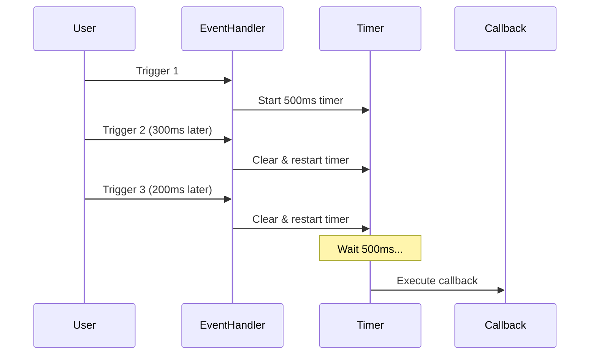
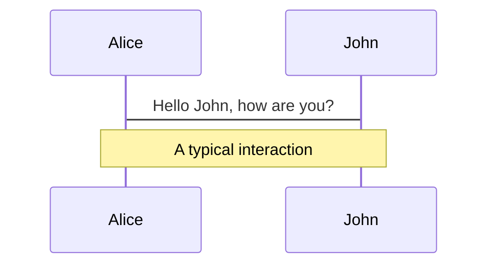
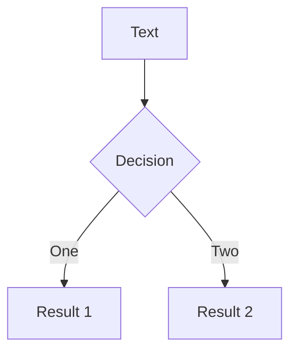
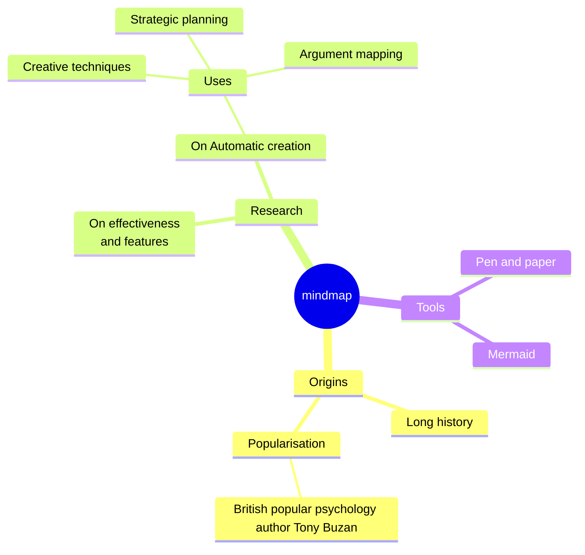
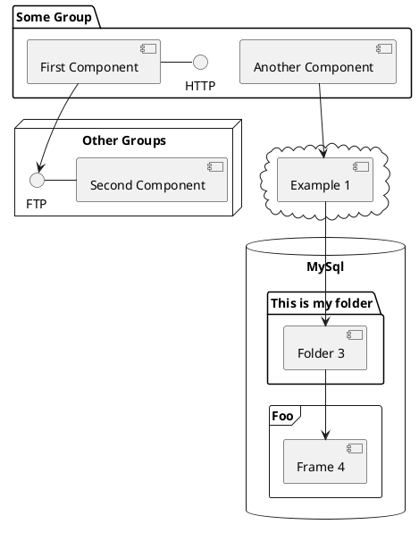

# Understanding Debounce

A Performance Optimization Technique

<div class="pt-12">
  <span @click="$slidev.nav.next" class="px-2 py-1 rounded cursor-pointer" hover:bg="white op-10">
    Press Space for next page <carbon:arrow-right class="inline"/>
  </span>
</div>

---
transition: fade-out
---

# The Problem

When events fire too frequently, performance suffers

<v-clicks>

- 🔍 **Search Input**: Every keystroke triggers an API call
- 📝 **Form Validation**: Validating on each character change
- 📏 **Window Resize**: Hundreds of events per second
- 🖱️ **Mouse Movement**: Continuous tracking floods handlers

</v-clicks>

<v-click>

<div class="mt-8 p-4 bg-orange-500/20 rounded">

**Result**: Excessive function calls, wasted resources, degraded UX

</div>

</v-click>

---

transition: slide-up
---

# What is Debounce?

<div class="text-xl leading-relaxed">

**Debounce** groups multiple sequential function calls into a single execution.

</div>

<v-click>

<div class="mt-8">

## Key Concept

The function executes only after a specified delay from the **last trigger**

</div>

</v-click>

<v-click>

````md magic-move {lines: true}
```js
// Without debounce: 5 calls
input.addEventListener('keyup', search)
// typing "hello" → search(), search(), search(), search(), search()
```

```js
// With debounce: 1 call
input.addEventListener('keyup', debounce(search, 500))
// typing "hello" → ... → search() (after 500ms of silence)
```
````

</v-click>

layout: two-cols
layoutClass: gap-16
---

# Common Use Cases

When should you use debounce?

::left::

<v-clicks>

## 🔍 Search Autocomplete

```js
searchInput.addEventListener('input',
  debounce(fetchSuggestions, 300)
)
```

Wait for user to finish typing before querying

## 📝 Form Validation

```js
emailInput.addEventListener('input',
  debounce(validateEmail, 500)
)
```

Validate after user pauses

</v-clicks>

::right::

<v-clicks>

## 📏 Window Resize

```js
window.addEventListener('resize',
  debounce(recalculateLayout, 200)
)
```

Recalculate only after resizing stops

## 💾 Auto-save

```js
editor.addEventListener('input',
  debounce(saveDraft, 1000)
)
```

Save changes after user stops editing

</v-clicks>

---

# Implementation

Let's build debounce from scratch

````md magic-move {lines: true}
```js
// Step 1: Basic structure
function debounce(callback, delay) {
  // We'll implement this
}
```

```js {2-3}
// Step 2: Store timer ID
function debounce(callback, delay) {
  let timerID;

}
```

```js {4-6}
// Step 3: Return a new function
function debounce(callback, delay) {
  let timerID;
  return function(...args) {
    // Handle the call
  }
}
```

```js {5}
// Step 4: Clear previous timer
function debounce(callback, delay) {
  let timerID;
  return function(...args) {
    clearTimeout(timerID);

  }
}
```

```js {6-8}
// Step 5: Set new timer
function debounce(callback, delay) {
  let timerID;
  return function(...args) {
    clearTimeout(timerID);
    timerID = setTimeout(() => {
      callback.apply(this, args);
    }, delay);
  }
}
```

```js
// Final implementation
function debounce(callback, delay) {
  let timerID;
  return function(...args) {
    clearTimeout(timerID);
    timerID = setTimeout(() => {
      callback.apply(this, args);
    }, delay);
  }
}
```
````

level: 2
---

# How It Works

Visual timeline of debounce execution

<div class="mt-8">



</div>

<v-click>

<div class="mt-4 p-4 bg-blue-500/20 rounded">

**Key**: Each new trigger resets the countdown. Callback runs only after silence.

</div>

</v-click>

---

# Leading Option

Execute immediately on first call, then debounce

<v-clicks>

```js {all|2|5-8|9-11|all}
function debounce(callback, delay, leading = false) {
  let timerID;
  return function(...args) {
    const callNow = leading && !timerID;

    clearTimeout(timerID);
    timerID = setTimeout(() => {
      timerID = null;
      if (!leading) callback.apply(this, args);
    }, delay);

    if (callNow) callback.apply(this, args);
  }
}
```

<div class="mt-4">

- **Use case**: Submit button that should respond immediately but prevent spam clicks
- First click executes instantly
- Subsequent clicks within delay window are ignored

</div>

</v-clicks>

layout: two-cols
layoutClass: gap-8
---

# Debounce vs Throttle

Two different rate-limiting techniques

::left::

## Debounce

<v-clicks>

- Waits for **silence**
- Executes **after** events stop
- Resets timer on each trigger
- Good for: search, validation, auto-save

```js
// Last call wins
Events: ||||||||___
Execute:         ⬆
```

</v-clicks>

::right::

## Throttle

<v-clicks>

- Maintains **fixed rate**
- Executes **during** events
- Ignores calls while timer active
- Good for: scroll, resize, tracking

```js
// Fixed intervals
Events: ||||||||||||
Execute: ⬆   ⬆   ⬆
```

</v-clicks>

---

# Clicks Animations

You can add `v-click` to elements to add a click animation.

<div v-click>

This shows up when you click the slide:

```html
<div v-click>This shows up when you click the slide.</div>
```

</div>

<br>

<v-click>

The <span v-mark.red="3"><code>v-mark</code> directive</span>
also allows you to add
<span v-mark.circle.orange="4">inline marks</span>
, powered by [Rough Notation](https://roughnotation.com/):

```html
<span v-mark.underline.orange>inline markers</span>
```

</v-click>

<div mt-20 v-click>

[Learn more](https://sli.dev/guide/animations#click-animation)

</div>

---

# Motions

Motion animations are powered by [@vueuse/motion](https://motion.vueuse.org/), triggered by `v-motion` directive.

```html
<div
  v-motion
  :initial="{ x: -80 }"
  :enter="{ x: 0 }"
  :click-3="{ x: 80 }"
  :leave="{ x: 1000 }"
>
  Slidev
</div>
```

<div class="w-60 relative">
  <div class="relative w-40 h-40">
    
    
    
  </div>

  <div
    class="text-5xl absolute top-14 left-40 text-[#2B90B6] -z-1"
    v-motion
    :initial="{ x: -80, opacity: 0}"
    :enter="{ x: 0, opacity: 1, transition: { delay: 2000, duration: 1000 } }">
    Slidev
  </div>
</div>

<!-- vue script setup scripts can be directly used in markdown, and will only affects current page -->
<script setup lang="ts">
const final = {
  x: 0,
  y: 0,
  rotate: 0,
  scale: 1,
  transition: {
    type: 'spring',
    damping: 10,
    stiffness: 20,
    mass: 2
  }
}
</script>

<div
  v-motion
  :initial="{ x:35, y: 30, opacity: 0}"
  :enter="{ y: 0, opacity: 1, transition: { delay: 3500 } }">

[Learn more](https://sli.dev/guide/animations.html#motion)

</div>

---

# $\LaTeX$

$\LaTeX$ is supported out-of-box. Powered by [$\KaTeX$](https://katex.org/).

<div h-3 />

Inline $\sqrt{3x-1}+(1+x)^2$

Block
$$ {1|3|all}
\begin{aligned}
\nabla \cdot \vec{E} &= \frac{\rho}{\varepsilon_0} \\
\nabla \cdot \vec{B} &= 0 \\
\nabla \times \vec{E} &= -\frac{\partial\vec{B}}{\partial t} \\
\nabla \times \vec{B} &= \mu_0\vec{J} + \mu_0\varepsilon_0\frac{\partial\vec{E}}{\partial t}
\end{aligned}
$$

[Learn more](https://sli.dev/features/latex)

---

# Diagrams

You can create diagrams / graphs from textual descriptions, directly in your Markdown.

<div class="grid grid-cols-4 gap-5 pt-4 -mb-6">









</div>

Learn more: [Mermaid Diagrams](https://sli.dev/features/mermaid) and [PlantUML Diagrams](https://sli.dev/features/plantuml)

---
foo: bar
dragPos:
  square: 691,32,167,_,-16
---

# Draggable Elements

Double-click on the draggable elements to edit their positions.

<br>

###### Directive Usage

```md

```

<br>

###### Component Usage

```md
<v-drag text-3xl>
  <div class="i-carbon:arrow-up" />
  Use the `v-drag` component to have a draggable container!
</v-drag>
```

<v-drag pos="663,206,261,_,-15">
  <div text-center text-3xl border border-main rounded>
    Double-click me!
  </div>
</v-drag>


###### Draggable Arrow

```md
<v-drag-arrow two-way />
```

<v-drag-arrow pos="67,452,253,46" two-way op70 />

---
src: ./pages/imported-slides.md
hide: false
---

---

# Monaco Editor

Slidev provides built-in Monaco Editor support.

Add `{monaco}` to the code block to turn it into an editor:

```ts {monaco}
import { ref } from 'vue'
import { emptyArray } from './external'

const arr = ref(emptyArray(10))
```

Use `{monaco-run}` to create an editor that can execute the code directly in the slide:

```ts {monaco-run}
import { version } from 'vue'
import { emptyArray, sayHello } from './external'

sayHello()
console.log(`vue ${version}`)
console.log(emptyArray<number>(10).reduce(fib => [...fib, fib.at(-1)! + fib.at(-2)!], [1, 1]))
```

---
layout: center
class: text-center
---

# Learn More

[Documentation](https://sli.dev) · [GitHub](https://github.com/slidevjs/slidev) · [Showcases](https://sli.dev/resources/showcases)

<PoweredBySlidev mt-10 />
